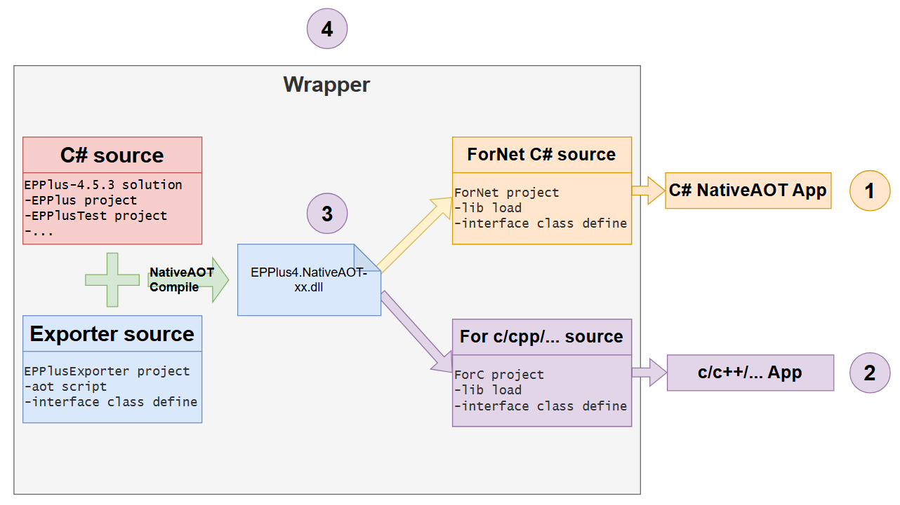

# EPPlus 4 AOT Wrapper

This project provides a NativeAOT-compatible wrapper  that enables LGPL compliance, cross-language integration, high-performance processing with full resource management, exception handling, and comprehensive large-class-library calling capabilities.

Keywords: nativeaot, aot



---

## What is it?
#### Scenario 1：LGPL compliance 
You have a commercial app developed in C# that must be compiled with NativeAOT. However, you need to use a third-party C# library licensed under LGPL. Directly referencing it as a package won't work because NativeAOT compiles everything into a single binary, making it impossible to distribute the LGPL component separately. This violates LGPL compliance. **This project allows you to isolate the LGPL component into a standalone .lib file**, ensuring legal compliance.

#### Scenario 2：Cross-language integration
You are developing an application in C/C++ (or another language), but want to leverage a powerful third-party component written in C#. **This project enables you to embed such components seamlessly into your application**.

#### Scenario 3：Ready-to-use EPPlus wrapper
Since this project is used in real-world applications, **you get a ready-to-use, stable, and high-performance wrapper for EPPlus 4**.

#### Scenario 4：Complex object interoperability
Most tutorials on calling native libraries only demonstrate simple function calls. Few show how to interact with complex class libraries, especially when passing complex objects across boundaries. **This project provides a practical example of doing exactly that**, serving as a reference for similar use cases.


## Features

- ⭐️ **LGPL Compliance Solution**: End-to-end implementation
- ⭐️ **Complete Resource Management**: Handles cascaded disposal and proper freeing of unmanaged resources. In practice: static methods perform ~2x slower; object calls with large strings degrade by an order of magnitude.
- ⭐️ **Full Library Support**: Enables calling the entire third-party class library
- ⭐️ **Callback Support**: For example, progress reporting via `IntPtr` pointer exchange and marshaling conversion
- ⭐️ **Exception Propagation**: Exceptions thrown in the wrapped library can be caught and handled properly
- ⭐️ **GC Memory Control**: Allows setting limits on maximum garbage-collected memory usage
- ⭐️ **Thread Safety**: Complete multi-threading safety with proper synchronization mechanisms
- ⭐️ **Embedded Logging**: Built-in logging capabilities for debugging and monitoring

## Getting Started

```bash
git clone https://github.com/orunco/EPPlus4AOTWrapper.git
cd Wrapper
# Open the project in your preferred IDE
Run `aot-win-x64-release-for-lgplv3.bat` to build the lib file

cd App/NetcoreApp
# Open the project in your preferred IDE
Run `Demo`, which will generate an `EPPlus4-demo.xlsx` file
```

## Requirements

- .NET 8+
- C++ compilation runtime
- Zero additional dependencies

## License

**MIT** © Pete Zhang
